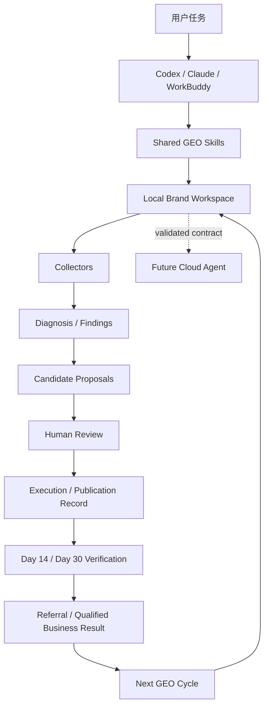
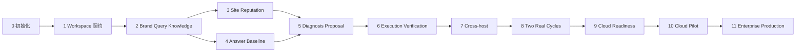

# Geo Agents 本地优先 GEO 专家项目初始化 Handoff

## 0. 给接手 Agent 的直接指令

你正在接手 `weiyan2026/geo-agents` 的下一条产品主线。

你的任务不是重新设计一个泛化的多 Agent 平台，也不是立即建设 MCP、云端调度、中心数据库或自动发布系统。你的首要任务是：

> **在现有仓库内初始化一套由 Codex、Claude、WorkBuddy 等 Agent 宿主直接执行、以 Git 管理的本地文件工作区为状态和交付中心的 GEO 全生命周期专家。**

当前 Handoff 只授权你完成：

1. 项目基线核验；
2. 新主线的 canonical 文档与架构决策；
3. 本地工作区、文件契约、模板和机械校验能力；
4. `MyyShop` 首个工作区骨架；
5. Codex 首个初始化 Skill；
6. 对应测试、Record 和 Draft PR。

完成上述范围后必须停止，不得自动进入真实平台采集、内容发布、云端部署、CRM 写入或下一里程碑。

不得仅输出方案。必须在授权范围内形成仓库文件、测试、验证证据和可继续执行的 Handoff。

---

# 一、继承基线

## 1.1 当前仓库状态

以接手时实际 `master` 为准。本 Handoff 编写时观察到：

```text
repository: weiyan2026/geo-agents
branch: master
HEAD: c0a23fc8b5cb4527a57c1d2c6f52c36694b6b1cd
```

当前仓库的既有 MVP 开发路线 M0—M8 已经收口，Query Analysis、Asset Change、Answer Testing、Referral、Qualified Creator Attribution、Runtime Recovery、Continuous GEO Operations 等能力均已有开发实现和证据链；但真实 Query、正式 Evidence、真实页面、真实生成式平台答案、真实 Analytics/CRM、业务验证、发布和生产运行仍处于外部门阶段。

正式答案基线 `MYYS-QS-001` 仍是：

```text
0 / 144 real platform samples
```

不得把现有 fixture、本地测试或模拟结果升级为真实业务结果。

## 1.2 双轨继承，而不是推倒重来

从本 Handoff 开始，项目形成两条并行但不互相冒充的轨道：

### 轨道 A：既有云端 MVP 能力证据链

```text
现有 Domain / Runtime / API / PostgreSQL / Console
→ 保留
→ 不删除
→ 不批量重写
→ 外部门状态继续保持 pending
```

### 轨道 B：本地 Agent 全生命周期验证主线

```text
Codex / Claude / WorkBuddy
→ Shared GEO Skills
→ Git 管理的本地 Workspace
→ 真实 Query / Knowledge / Site / Reputation / Answers
→ Proposal / Human Review / Publication Record
→ Day 14 / Day 30 Verification
→ AI Referral / Qualified Creator
→ 云端化准入决策
```

本地主线不是旧系统的临时 Demo。它是业务流程和文件契约的验证场，也是未来云端 Agent 的输入、输出、导入、导出和审计协议来源。

## 1.3 必须继承的现有宪法

以下规则继续有效：

1. Query 与 Query Cluster 是最小运营单元；
2. Claim 是唯一可治理的事实单元；
3. 模型输出不是 Evidence；
4. Agent 只负责理解、诊断、候选和提案；
5. 人类负责采纳、审批、发布和业务判断；
6. 一次业务旅程只对用户形成一个统一结论；
7. 确定性规则不包装成 Agent；
8. 新代码使用稳定业务语义，不使用里程碑前缀；
9. 机器验收、Owner 体验、业务验证、发布批准和运行验证分别记录；
10. 未获得显式授权时不连接生产系统、不写外部系统、不部署。

---

# 二、用户已经确认的关键决策

以下内容不是待讨论假设，而是本项目新主线的约束：

## 2.1 执行中心

当前阶段由以下 Agent 宿主直接执行：

```text
Codex
Claude Code / Claude Agent
WorkBuddy
后续兼容其他支持 Skill、文件和浏览工具的 Agent 宿主
```

不要求 MCP 才能运行。

## 2.2 状态与交付中心

当前阶段的权威交付物是本地文件：

```text
Markdown             人类可读的主要业务交付物
YAML Frontmatter     机器可读的元数据和状态
JSONL                Sample Matrix、原始采集索引、事件流
JSON                 内部 Schema、校验和可恢复状态
HTML                 页面快照、候选页面和复验材料
PNG / WebP           截图、视觉证据
Git Diff / Commit    版本、人工 Review 和审计链
```

聊天内容不是长期状态。没有进入 canonical 文件的聊天结论不构成项目事实。

## 2.3 云端建设顺序

```text
先完成本地全链路
→ Codex 实跑
→ Claude 复跑
→ WorkBuddy 兼容
→ 完成至少两个真实 GEO 周期
→ 证明哪些环节确实需要调度、权限、存储或长期运行
→ 再建设云端 Agent
```

## 2.4 当前明确不采用的前提

以下能力当前不是运行前提：

```text
MCP Gateway
Cloud Agent API
中心化 PostgreSQL 作为本地主线事实源
Redis / BullMQ
ClickHouse
MongoDB
etcd
多租户权限系统
自动发布
自动 CRM 写入
```

未来可以建设，但必须由真实运行证据触发。

---

# 三、项目最终目标

## 3.1 最终业务目标

建设一套面向企业品牌的 GEO 全生命周期管理专家与运行系统，使企业能够持续回答：

```text
用户真实在问什么？
品牌是否有可验证、可公开的答案？
官网和站外信息是否一致？
生成式平台是否提到品牌、如何描述、引用了谁？
竞品为什么占据答案？
应该补事实、补页面、补第三方 Presence，还是修技术基建？
哪些内容应该修改？
修改后是否真实改善？
是否带来 AI Referral、注册和合格业务线索？
```

MyyShop 试点的最终北极星指标继续是：

```text
Qualified Creator from AI Referral
来自 AI 来源的合格达人数量
```

## 3.2 最终产品形态

最终产品不是多个用户可见 Agent，而是一个 GEO 专家：

```text
用户任务
→ GEO 专家理解范围
→ 读取品牌 Workspace
→ 调用必要的采集、诊断和提案 Skill
→ 写入统一交付文件
→ 明确人类审批项
→ 复验和业务结果
```

内部可以有多个 Skill、确定性脚本和受控推理步骤，但用户只看到一个业务旅程和一份统一结论。

## 3.3 最终技术形态

最终系统支持两种平等执行模式：

### 本地 Agent 模式

```text
Codex / Claude / WorkBuddy
→ Shared Skills
→ Local Workspace
→ Git Review
```

适合专家诊断、项目制交付、单品牌试点、审计和复杂内容工作。

### 云端 Agent 模式

```text
Cloud Control Plane
→ Durable Runs / Scheduled Collectors
→ Tenant / Permission / Approval
→ Object Storage / Queryable History
→ Console / Alert / CRM Read Integration
```

适合多品牌、多人协作、周期采集、大规模答案测试和企业持续运营。

两种模式必须使用同一套业务语义和 Artifact Contract。云端不得重新定义另一套 Query、Knowledge、Finding 或 Run 模型。

## 3.4 最终完成定义

只有同时满足以下条件，项目才达到最终目标：

1. MyyShop 的品牌定位、Query、知识、Evidence、站点、舆情、答案、竞品和执行状态可以由文件完整表达；
2. Codex、Claude、WorkBuddy 可以读取同一 Workspace 并继续彼此的工作；
3. 正式完成真实生成式平台答案基线，不混入 fixture；
4. 每个关键 Finding 可追溯、可复现、可修复、可复验；
5. 内容修改只能使用已批准事实，缺失事实必须形成 Evidence Gap；
6. 完成发布前后 Day 14 / Day 30 可比复验；
7. 完成至少两个真实 GEO 运营周期；
8. 能连接 AI Referral、Signup 和 Qualified Creator/Brand Lead；
9. 云端 Agent 能导入、执行并导出同一套 Workspace 契约；
10. 云端生产模式具备权限、审计、监控、回滚和人工审批门。

---

# 四、项目边界

## 4.1 本项目包含

```text
品牌实体和定位管理
Query Portfolio
品牌知识库和 Evidence
站点与分发资产审计
搜索和生成式抓取基础检查
品牌舆情和第三方观察
生成式平台答案测试
竞品 Query / Source / Content Gap
GEO 优化策略
内容 Brief 与候选变更
人工 Review 和发布记录
发布后复验
AI Referral 与业务结果
持续周期运营
跨宿主插件分发
后续云端化
```

## 4.2 当前阶段不包含

```text
未经授权访问生产系统
自动批准 Claim
自动发布网页
自动创建公开社区内容
自动写 CRM
共享 AI 平台账号
规避平台反自动化机制
将模型 API 结果伪装为真实产品 UI 结果
用单一 GEO 总分替代具体 Finding
```

## 4.3 许可证边界

开源项目主要用于架构和接口吸收。复制代码前必须核对许可证：

- GPL 项目默认只吸收设计和契约，不直接复制进入可能闭源的核心；
- MIT / Apache 等仍需保留归属并记录来源；
- 研究代码和论文指标不得被描述为生产效果保证。

---

# 五、目标架构

## 5.1 总体结构



## 5.2 仓库目标结构

最终目标结构如下。初始化里程碑只创建当前需要的部分，不为“看起来完整”建立空实现：

```text
geo-agents/
├── plugins/
│   └── geo-expert/
│       ├── shared/
│       │   ├── skills/
│       │   ├── templates/
│       │   ├── schemas/
│       │   └── references/
│       ├── codex/
│       ├── claude/
│       └── workbuddy/
│
├── workspaces/
│   └── myyshop/
│       ├── README.md
│       ├── STATUS.md
│       ├── LOG.md
│       ├── brand/
│       ├── queries/
│       ├── knowledge/
│       ├── site/
│       ├── reputation/
│       ├── answers/
│       ├── competitors/
│       ├── strategy/
│       ├── execution/
│       ├── playbooks/
│       ├── cycles/
│       └── runs/
│
├── packages/
│   ├── workspace-contracts/
│   ├── artifact-validation/
│   ├── local-collectors/
│   └── geo-diagnosis/
│
├── scripts/
│   ├── geo-workspace-init.mjs
│   ├── geo-workspace-validate.mjs
│   ├── geo-build-index.mjs
│   ├── geo-run-resume.mjs
│   └── geo-compare-runs.mjs
│
└── docs/
    ├── research/geo-open-source/
    ├── requirements/
    ├── specs/
    ├── plans/
    ├── tasks/
    ├── records/
    ├── handoff/
    └── wiki/
```

## 5.3 三类职责必须分离

### Skill

负责：

- 什么时候执行；
- 必须读取什么；
- 如何推理；
- 必须输出什么文件；
- 什么情况下停止；
- 哪些结果需要人工 Review。

### 确定性脚本

负责：

- 初始化目录；
- 校验 Frontmatter；
- 检查状态转换；
- 检查引用文件；
- 计算 checksum；
- 生成索引；
- 比较 Run；
- 检查硬门。

### Workspace

负责：

- 品牌事实；
- Query；
- Evidence；
- 原始采集；
- Finding；
- Proposal；
- Review；
- Run 和周期状态。

不得把业务事实硬编码进 Skill，也不得把推理规则藏在初始化脚本里。

---

# 六、本地 Artifact 权威模型

## 6.1 权威层级

从高到低：

```text
已授权原始来源 / Evidence
→ 人类批准的 Claim / Knowledge Entry
→ 原始网页、答案、舆情 Observation
→ Agent 诊断 Finding
→ Agent 候选 Proposal
→ 聊天临时输出
```

较低层不得自动升级为较高层。

## 6.2 主要状态机

### Query

```text
candidate
→ reviewed
→ approved
→ deprecated
```

### Knowledge Entry

```text
proposed
→ evidence_missing | review_pending
→ approved
→ deprecated
```

### External Observation

```text
observed
→ reviewed
→ dismissed | linked_to_evidence_candidate
```

Observation 永远不直接成为 Approved Evidence。

### Finding

```text
open
→ accepted | blocked | rejected
→ resolved
→ verified
```

`resolved` 只表示已修改；`verified` 表示已经复验。

### Proposal

```text
proposed
→ review_pending
→ accepted_as_draft | rejected
```

不包含 `approved` 或 `published`。

### Run

```text
planned
→ running
→ partial | completed | failed | cancelled
```

## 6.3 文件格式原则

1. 业务主文件使用 Markdown；
2. 第一行开始使用 YAML Frontmatter；
3. ID 稳定，不使用文件名作为唯一业务身份；
4. 原始答案、网页、截图必须由 Markdown 索引；
5. 每个来源记录 URL、时间、采集方式和 checksum；
6. 每个 Finding 记录 Source、Locator、Severity、Confidence 和 Retest；
7. Timeline、LOG 和原始 Run Receipt 只追加；
8. Agent 不得静默覆盖已批准文件；
9. 敏感原始资料使用本地 gitignored 目录或 EvidenceLocator，不提交凭据、Cookie、Token 或 PII；
10. 文件损坏时必须失败，不得自动猜测补全 Approved 状态。

---

# 七、共享 GEO Skills

最终应形成以下 Skill 集合：

| Skill | 主要任务 | 主要输出 |
| --- | --- | --- |
| `geo-expert` | 统一入口和任务路由 | 一个统一 Run 与结论 |
| `geo-init` | 初始化品牌工作区 | Brand、Status、Log |
| `geo-query-portfolio` | 发现、审核、聚类 Query | Query Set / Clusters |
| `geo-knowledge-audit` | 知识和 Evidence 准备度 | Knowledge Index / Gaps |
| `geo-site-audit` | 站点和分发资产审计 | Snapshots / Findings |
| `geo-reputation-audit` | 舆情和第三方 Presence | Observations / Themes |
| `geo-answer-test` | 多平台答案测试 | Matrix / Captures / Report |
| `geo-competitor-gap` | Query、Source、Content 差距 | Gap Reports |
| `geo-plan` | 统一策略、内容和实验提案 | Optimization / Content Plan |
| `geo-cycle` | 周期复盘和下一步 | Cycle / Actions / Results |

Skill 是用户任务单元，不是十个用户可见 Agent。

---

# 八、开源能力吸收映射

| 项目 | 吸收内容 | 当前不吸收 |
| --- | --- | --- |
| E-GEOagents | 本地 Workspace、Frontmatter、LOG、Timeline、Runtime Adapter、文件产物 | 合成竞品排名作为真实效果 |
| UnifAPI Agents | Shared Skills、多宿主薄适配、原子任务、只读研究边界 | 远程 MCP 作为当前依赖 |
| Gego | Provider 接口、Run/Job/Attempt、Sample Matrix、失败和限流语义 | PostgreSQL+MongoDB+etcd 整体基础设施 |
| OneGlanse | 真实产品 UI Collector Profile、引用提取、部分成功、原始采集与分析分离 | 反指纹、住宅代理、规避平台限制 |
| AgentGEO | 失败分类、Query 级竞品对照、Chunk Locator、局部修复和复验 | 无治理约束的自动重写 |
| MAGEO | 多候选、Fidelity Gate、重评估、早停和成功模式 | 模拟指标作为业务效果、自动跨品牌 Memory |
| 当前 geo-agents | Query、Claim、Evidence、Asset、Answer、Referral、Qualified Creator、人工治理 | 不被开源项目替换 |

完整源码级研究见本 Handoff 同包的 `research/` 文件。

---

# 九、初始化 Agent 的实际动作

以下步骤按顺序执行。不得跳过基线、文档和测试直接写功能。

## 9.1 核验实际仓库状态

执行并记录：

```bash
git status --short
git branch --show-current
git rev-parse HEAD
git log -1 --oneline
```

规则：

- 若工作区不干净，不覆盖用户改动；
- 若 `master` 已超过本 Handoff 的观察 HEAD，不 reset，记录新 HEAD 并比较变化；
- 若无法访问远端，仍可在当前可验证基线上继续，但必须记录限制。

## 9.2 读取强制文档

按顺序阅读：

```text
AGENTS.md
ARCHITECTURE.md
docs/workflow.md
docs/handoff/2026-08-09-mvp-external-gates-handoff.md
README.md
docs/wiki/brand-knowledge-base-geo-recommendations-v1.md
本 Handoff
research/README.md
research/07-cross-project-comparison-and-geo-agents-adoption.md
其他项目研究文档
```

## 9.3 建立机器基线

执行：

```bash
corepack enable
pnpm install --frozen-lockfile
pnpm validate
pnpm test:integration
pnpm build
```

必须区分：

- 接手前已经存在的失败；
- 本次变更引入的失败；
- 因环境、凭据或外部服务导致的未执行项。

## 9.4 创建工作分支

推荐：

```bash
git switch -c feat/geo-expert-local-foundation
```

若仓库约定不同，使用等价的稳定业务语义名称。分支和运行时代码不得出现 `m9`、`next-stage`、`new-version` 等漂移命名。

## 9.5 导入研究和新 canonical Handoff

将本交付包映射到仓库：

```text
2026-08-16-local-first-geo-expert-project-initialization-handoff.md
→ docs/handoff/2026-08-16-local-first-geo-expert-project-initialization-handoff.md

research/*.md
→ docs/research/geo-open-source/*.md
```

新增：

```text
docs/research/index.md
docs/research/geo-open-source/index.md
```

不得把研究摘要变成企业事实。

## 9.6 创建新主线 canonical 文档

至少创建：

```text
docs/requirements/2026-08-16-local-first-geo-expert.md
docs/specs/local-first-geo-expert-foundation-spec-v1.md
docs/plans/2026-08-16-local-first-geo-expert-foundation-plan.md
docs/tasks/2026-08-16-local-first-geo-expert-foundation.md
docs/wiki/ADR-0011-local-first-geo-expert-workspace.md
docs/records/2026-08-16-local-first-geo-expert-baseline.md
```

同步：

```text
docs/index.md
docs/wiki/index.md
README.md
AGENTS.md
```

`AGENTS.md` 更新后必须表达双轨状态：

```text
既有云端 MVP：external gates pending，状态不变
本地 GEO 专家：foundation active
```

不得把既有外部门批量标成已完成。

## 9.7 处理旧 `init.md`

根目录 `init.md` 是历史云端优先初始化上下文。不要删除。

推荐处理：

- 在其顶部增加 `superseded_for_new_local-first-program` 提示；
- 链接本 Handoff；
- 明确它仍是旧 MVP 的历史来源；
- 不批量重写旧内容。

只有在 Owner 确认后执行状态更新；否则在 Plan 中列为待 Review。

## 9.8 初始化最小目录

本里程碑实际创建：

```text
plugins/geo-expert/shared/skills/geo-init/
plugins/geo-expert/shared/templates/workspace/
plugins/geo-expert/shared/schemas/
plugins/geo-expert/shared/references/
plugins/geo-expert/codex/

workspaces/myyshop/
packages/workspace-contracts/
packages/artifact-validation/
```

暂不创建没有代码的 `local-collectors` 和 `geo-diagnosis` package；等对应里程碑出现真实职责再建。

## 9.9 实现工作区初始化和校验

首批脚本：

```text
scripts/geo-workspace-init.mjs
scripts/geo-workspace-validate.mjs
scripts/geo-build-index.mjs
```

建议 package scripts：

```json
{
  "geo:workspace:init": "node scripts/geo-workspace-init.mjs",
  "geo:workspace:validate": "node scripts/geo-workspace-validate.mjs",
  "geo:workspace:index": "node scripts/geo-build-index.mjs",
  "test:geo-workspace": "vitest run packages/workspace-contracts packages/artifact-validation"
}
```

要求：

- 初始化幂等；
- 不覆盖已有文件；
- 目录名、ID、状态和引用可校验；
- 报错包含 `path:line: message`；
- 运行失败返回非零状态；
- 不调用模型；
- 不需要数据库；
- 不扫描工作区外的文件；
- 防止路径穿越和符号链接越界；
- 不读取或输出凭据。

## 9.10 初始化 MyyShop Workspace

最小文件：

```text
workspaces/myyshop/README.md
workspaces/myyshop/STATUS.md
workspaces/myyshop/LOG.md
workspaces/myyshop/brand/brand-profile.md
workspaces/myyshop/brand/positioning.md
workspaces/myyshop/brand/terminology.md
workspaces/myyshop/brand/competitors.md
workspaces/myyshop/queries/query-candidates.md
workspaces/myyshop/queries/query-set.md
workspaces/myyshop/queries/query-clusters.md
workspaces/myyshop/knowledge/README.md
workspaces/myyshop/knowledge/knowledge-index.md
workspaces/myyshop/runs/README.md
```

初始化数据只允许来自：

- 当前仓库 canonical 文档；
- 用户已经明确确认的品牌战略；
- 明确标识的 fixture 或 synthetic seed。

规则：

- 用户已确认的新定位可以写入 `positioning.md`，但正式对外使用状态仍应保留 Owner、Approver 和 Evidence 字段；
- 缺少证据的条目使用 `evidence_missing`；
- synthetic Query 只能进入 `query-candidates.md`；
- 不得为了让校验变绿伪造 Approver 或 Evidence；
- 无真实来源时允许空状态和 blocker，不允许伪事实。

## 9.11 实现 `geo-init` Skill

`SKILL.md` 必须定义：

- 触发场景；
- 必读文件；
- 输入；
- 初始化动作；
- 输出文件；
- 状态边界；
- 敏感数据边界；
- 停止条件；
- 完成回报。

Codex 适配只负责发现和加载 Shared Skill，不复制业务正文。

## 9.12 测试

至少覆盖：

1. 新品牌工作区可初始化；
2. 重复初始化不修改已有字节；
3. 缺失必填 Frontmatter 失败；
4. 非法状态失败；
5. `approved` Knowledge 缺 Evidence / Owner / Approver 失败；
6. Query 引用不存在的 Knowledge 失败；
7. External Observation 被标成企业 Evidence 失败；
8. 绝对路径、`../` 和越界符号链接失败；
9. LOG 语法错误失败；
10. 空骨架可以通过“结构完整但业务未验证”的校验模式；
11. 严格业务模式能正确报告 Evidence blocker；
12. 现有 `pnpm validate`、集成测试和 build 不回归。

## 9.13 完成 Record 和 Draft PR

新增：

```text
docs/records/2026-08-16-local-first-geo-expert-foundation-acceptance.md
docs/handoff/2026-08-16-local-first-geo-expert-next-handoff.md
```

Draft PR 推荐标题：

```text
feat: initialize local-first GEO expert workspace
```

PR 只完成当前 Handoff 授权范围，不夹带站点采集、答案自动化或云端能力。

---

# 十、初始化里程碑验收标准

项目初始化与本地工作区基础里程碑完成时，必须同时满足：

## 10.1 文档门

- 新 Requirement、Spec、Plan、Task、ADR、Record、Handoff 完整；
- `docs/index.md` 和 `AGENTS.md` 可导航；
- 双轨状态无歧义；
- 旧外部门状态未被错误升级；
- 本地文件优先和云端准入条件写入 canonical ADR。

## 10.2 工作区门

- `workspaces/myyshop` 能由脚本幂等初始化；
- 文件使用统一 Frontmatter；
- `STATUS.md` 能表达已知、缺口和 blocker；
- `LOG.md` 可追加且可校验；
- MyyShop 定位、候选 Query 和知识索引存在；
- 未经证据支持的内容没有 `approved` 状态。

## 10.3 Skill 门

- Codex 可以发现并执行 `geo-init`；
- Skill 只读写授权工作区；
- Skill 不依赖 MCP、数据库或云端；
- 另一个 Agent 可以仅通过文件继续工作。

## 10.4 机器门

必须报告实际结果：

```bash
pnpm geo:workspace:init -- --brand myyshop
pnpm geo:workspace:init -- --brand myyshop
pnpm geo:workspace:validate -- --workspace workspaces/myyshop
pnpm test:geo-workspace
pnpm validate
pnpm test:integration
pnpm build
```

## 10.5 人工门

Owner 至少检查：

- 目录是否直观；
- 定位和 Query 文件是否能被业务人员理解；
- 状态和 Evidence 缺口是否清楚；
- Codex 输出是否真正写入文件；
- 是否存在过度技术化或过度拆分；
- Claude 是否能读取并理解同一骨架。

机器门通过后状态最多是：

```text
development_complete / owner_experience_pending
```

---

# 十一、后续里程碑总览

| 顺序 | 里程碑 | 目标结果 | 前置条件 |
| --- | --- | --- | --- |
| 0 | 项目初始化与双轨基线 | 新主线有 canonical 入口和可信基线 | 本 Handoff |
| 1 | 本地工作区与交付契约 | Workspace、模板、校验、`geo-init` 可用 | 里程碑 0 |
| 2 | 品牌、Query 与知识基线 | MyyShop 有真实问题集和可治理知识库 | 里程碑 1 |
| 3 | 站内外资产与舆情诊断 | 页面、技术、第三方 Presence 和舆情可审计 | 里程碑 2 |
| 4 | 真实生成式平台答案基线 | 完成正式多平台 Query 测试 | 里程碑 2；可与 3 部分并行 |
| 5 | 统一诊断、竞品差距与优化提案 | 形成受 Evidence 支撑的行动与候选内容 | 里程碑 3、4 |
| 6 | 内容执行与发布后复验 | 完成 Draft、人工发布、Day 14 / Day 30 | 里程碑 5 |
| 7 | Codex / Claude / WorkBuddy 产品化 | 三宿主运行同一生命周期和文件契约 | 里程碑 6 |
| 8 | 两个真实 GEO 周期与业务归因 | 证明流程可持续并连接业务结果 | 里程碑 7 |
| 9 | 云端化准入与架构冻结 | 基于证据决定云端范围 | 里程碑 8 |
| 10 | 云端 Agent 试点 | 同一契约在云端持久运行 | 里程碑 9 |
| 11 | 企业级生产闭环 | 多品牌、权限、调度、监控和业务运营 | 里程碑 10 |

依赖关系：



---

# 十二、各里程碑详细定义

## 里程碑 0：项目初始化与双轨基线

### 目标

让本地优先主线成为仓库内可执行、可审计的新入口，同时完整保留现有云端 MVP 的历史与外部门状态。

### 交付物

```text
本 Handoff
开源研究文档
Requirement / Spec / Plan / Task
ADR-0011
Baseline Record
AGENTS / README / docs index 更新
```

### 验收

- 当前 HEAD 和机器基线明确；
- 双轨状态清晰；
- 没有自动启动后续里程碑；
- 没有修改生产、Approval、Publication、CRM 状态。

### 停止条件

- 当前分支存在无法识别的用户改动；
- baseline 失败且无法区分是否为存量问题；
- 新主线与现有架构出现需要 Owner 决策的直接冲突。

---

## 里程碑 1：本地工作区与交付契约

### 目标

建立跨 Agent 宿主共享的本地状态、文件模板和机械校验能力。

### 交付物

```text
plugins/geo-expert/shared
packages/workspace-contracts
packages/artifact-validation
scripts/geo-workspace-*
workspaces/myyshop skeleton
geo-init Skill
测试与 Acceptance Record
```

### 验收

- 幂等初始化；
- 文件契约可机械检查；
- Approved 状态不能绕过 Evidence 门；
- Codex 可执行；
- Claude 可读取；
- 无数据库和云端依赖。

---

## 里程碑 2：MyyShop 品牌、Query 与知识基线

### 目标

将 MyyShop 战略定位、用户问题、知识条目和证据关系形成真实可治理基线。

### 输入

- 品牌战略材料；
- 客服和业务问题；
- 现有官网、帮助中心和政策；
- 现有 `MYYS-QS-001`；
- 已授权内部 Evidence。

### 交付物

```text
brand/brand-profile.md
brand/positioning.md
brand/positioning-history.md
brand/terminology.md
queries/query-candidates.md
queries/query-set.md
queries/query-clusters.md
queries/query-coverage.md
knowledge/knowledge-index.md
knowledge/entries/*.md
knowledge/evidence/*.md
knowledge/answer-cards/*.md
knowledge/conflicts.md
```

### 业务范围

至少覆盖：

```text
品牌定义
谁可以加入
小体量或零粉丝达人
成长能力
活跃能力
商业化能力
费用、佣金、支付和限制
信任、隐私和责任
与 MCN / 联盟营销 / 竞品的差异
```

### 验收

- Approved Query 有真实来源；
- P0 Query 能映射 Knowledge 和 Asset；
- Approved Knowledge 有 Evidence、Owner、Approver、Scope 和有效期；
- 旧定位残留和冲突显式记录；
- 缺事实时返回 `partial` 或 `not_answerable`，不补写营销文案。

### 停止条件

- 缺少正式业务 Owner 或 Approver；
- 内部材料未获授权；
- 同一事实来源冲突且无法确定权威版本。

---

## 里程碑 3：站内外资产与舆情诊断

### 目标

对 3—5 个重点页面及关键站外来源完成 Query 级、可复验诊断。

### 技术范围

```text
HTTP / Redirect
robots / AI crawler matrix
noindex
canonical
sitemap
SSR / rendered content
Schema JSON 与正文一致性
hreflang
title / meta / body / FAQ / schema / llms consistency
旧定位残留
未支持事实
```

### 站外范围

```text
官方账号和 sameAs
媒体报道
合作伙伴
行业目录
独立评测
Reddit / YouTube / 社区讨论
错误事实和旧定位传播
竞品高频出现的第三方来源
```

### 交付物

```text
site/asset-index.md
site/snapshots/*
site/audits/<run-id>.md
site/findings/*.md
reputation/observations/*.md
reputation/themes.md
reputation/misinformation.md
reputation/reputation-report.md
competitors/competitor-profiles.md
```

### 验收

每个 Finding 至少包含：

```text
code
stage
severity
confidence
query_refs
asset_refs
source_refs
locator
impact
recommendation
retest
```

外部 Observation 不自动成为企业 Evidence。

---

## 里程碑 4：真实生成式平台答案基线

### 目标

基于固定 Query Set 和冻结 Collector Profile，完成真实 ChatGPT、Perplexity、Gemini 等平台答案测试。

### 采集模式

严格区分：

```text
authorized_manual
host_assisted_product_ui
official_api
fixture
```

禁止把 API 结果称为产品 UI 结果。

### 交付物

```text
answers/answer-query-set.md
answers/collector-profiles/*.md
answers/runs/<run-id>/run.md
answers/runs/<run-id>/sample-matrix.jsonl
answers/runs/<run-id>/captures/*.md
answers/runs/<run-id>/captures/*.png
answers/runs/<run-id>/analyses/*.md
answers/runs/<run-id>/review.md
answers/answer-baseline.md
```

### 正式基线要求

`MYYS-QS-001` 的 144 个计划样本必须全部被计入：

```text
answered
refused
failed
timeout
not_collected_with_reason
```

不得静默删除失败样本。

### 验收

- planned、received、reviewed_valid、failed、unknown 分母显式；
- Fixture 不进入正式基线；
- 记录平台、产品、可见模型、地区、语言、登录状态、联网状态、时间；
- 记录品牌提及、定位准确性、事实准确性、引用和竞品；
- 权威结论经过 Human Review。

---

## 里程碑 5：统一诊断、竞品差距与优化提案

### 目标

把 Query、知识、站点、舆情、答案和竞品结果汇总成一个业务结论，并产生受控候选方案。

### Finding Taxonomy

```text
Brand Identity
Positioning
Query Coverage
Knowledge and Evidence
Technical Integrity
Semantic Alignment
Content Extractability
External Presence
Reputation
Answer Accuracy
Competitor Ownership
Referral and Business Outcome
Collector Reliability
```

### 候选策略

每个高优先级 Finding 最多生成：

```text
A：最小安全修改
B：结构性修改
C：先补 Evidence / 外部 Presence，再修改
```

C 不得自由编造缺失事实。

### 交付物

```text
strategy/geo-diagnosis.md
strategy/optimization-plan.md
strategy/content-plan.md
strategy/experiment-plan.md
competitors/query-gap.md
competitors/source-gap.md
competitors/content-gap.md
competitors/positioning-gap.md
site/change-proposals/*.md
execution/task-backlog.md
```

### 硬门

- 事实型候选必须引用 Approved Claim；
- Scope 和有效期匹配；
- 未删除风险和限制；
- 未引入保证性表述；
- 没有敏感数据；
- Candidate 可稳定重建；
- 人类 Review 后最多形成 Draft。

### 验收

- 用户先看到统一结论、关键缺口和优先行动；
- 技术 Trace 放在详情；
- 每个 Proposal 可追溯到 Query、Finding、Claim、Evidence 和 Asset；
- 不声明尚未发生的真实可见度提升。

---

## 里程碑 6：内容执行与发布后复验

### 目标

把人工接受的 Proposal 转换为实际内容 Draft，记录发布，并用可比条件验证效果。

### 交付物

```text
execution/change-log.md
execution/publication-log.md
execution/verification-log.md
site/candidates/*
strategy/content-briefs/*.md
answers/runs/<day-14-run>/
answers/runs/<day-30-run>/
playbooks/cases/*.md
```

### 执行边界

- Agent 可以修改本地内容文件或创建 Draft PR；
- 人类批准和执行生产发布；
- 发布记录必须包含版本、时间、URL、Owner 和回滚信息；
- Finding 只有在复验后才进入 `verified`。

### 验收

- 前后 Query Set、Collector Profile 和 Rubric 可比；
- Day 14 / Day 30 完成；
- 失败和 Unknown 保留；
- 内容变化没有破坏事实忠实度；
- 成功案例记录适用边界，不夸大因果。

---

## 里程碑 7：Codex / Claude / WorkBuddy 跨宿主产品化

### 目标

让三类宿主使用同一套 Shared Skills 和 Workspace Contract 完成相同业务生命周期。

### 架构

```text
Shared Skill Source
├── Codex thin adapter
├── Claude thin adapter
└── WorkBuddy thin adapter / guide
```

宿主适配只处理发现、权限和工具映射，不复制业务逻辑。

### 交付物

```text
plugins/geo-expert/codex/*
plugins/geo-expert/claude/*
plugins/geo-expert/workbuddy/*
plugins/geo-expert/shared/skills/*
docs/wiki/host-capability-matrix-v1.md
runs/host-comparison/<id>/*
```

### 一致性测试

三宿主分别：

```text
读取同一 commit
读取同一 workspace snapshot
执行同一 Skill
输出不同 run-id
不得修改 Approved 状态
```

比较：

- Artifact 完整性；
- Finding Code；
- Source Ref；
- Evidence 安全；
- 严重度差异；
- 候选事实支撑；
- 可继续性。

### 验收

- 不存在三套业务实现；
- 一个宿主生成的 Run 可由另一个宿主继续；
- 差异报告明确哪些是模型差异，哪些是契约缺陷；
- WorkBuddy 不支持的能力有降级路径而不是伪装成功。

---

## 里程碑 8：两个真实 GEO 周期与业务归因

### 目标

证明该流程不是一次性审计，而是可重复运营闭环。

每个周期至少包含：

```text
Baseline
→ Findings
→ Proposal
→ Human Review
→ Publication
→ Day 14
→ Day 30
→ Referral / Signup
→ Qualified Creator / Brand Lead
→ Retrospective
```

### 交付物

```text
cycles/<period>/run.md
cycles/<period>/findings.md
cycles/<period>/actions.md
cycles/<period>/results.md
execution/referral-imports/*
execution/qualified-results/*
playbooks/successful-cases/*
docs/retrospectives/*
docs/lessons/*
```

### 验收

- 至少两个真实周期；
- 同一 Query 的变化可比较；
- 业务结果有来源和时间范围；
- AI Referral、Signup、Qualified 状态不混淆；
- 能识别哪些动作有效、无效或无法判断；
- 形成云端化需求的真实规模证据。

---

## 里程碑 9：云端化准入与架构冻结

### 目标

基于两个真实周期决定哪些能力应该云化，而不是凭想象复制开源平台。

### 云端触发信号

| 真实问题 | 候选云端能力 |
| --- | --- |
| 单次样本过多，单机无法完成 | Worker / Queue |
| 定时采集成为刚需 | Scheduler |
| 多人编辑冲突严重 | Tenant / Permission / Approval |
| 原始答案和截图超出 Git | Object Storage |
| 时间序列检索困难 | PostgreSQL / Analytics Store |
| 失败恢复成本高 | Durable Workflow |
| Analytics/CRM 需要服务身份 | Cloud Connector |
| 多品牌隔离 | Tenant Model |

### 交付物

```text
Cloud Readiness Report
Architecture Decision
Local-to-Cloud Contract Mapping
Threat Model
Data Classification
Cost and Capacity Model
Cloud Pilot Spec / Plan
```

### 验收

- 每个云端组件都有真实问题和规模证据；
- Workspace 可导入、导出；
- 云端不改变 Approval 和 Evidence 规则；
- 本地模式继续可用；
- 云端供应商和技术栈经过独立批准。

---

## 里程碑 10：云端 Agent 试点

### 目标

将已经验证的一个完整 GEO 周期抬升到云端执行，不扩大业务范围。

### 首个云端纵切

建议只包含：

```text
一个品牌
一个 Query Set
一种站点采集
一种授权答案采集
Workspace Import / Export
Durable Run
Read-only Dashboard
Human Review Gate
```

### 验收

- 云端 Run 与本地 Run 产物兼容；
- 可恢复、可取消、可重放且幂等；
- 凭据不进入模型、Trace 或 Artifact；
- 人类审批不被 Agent 绕过；
- 云端结果可完整导出为本地 Workspace；
- 生产写操作仍关闭。

---

## 里程碑 11：企业级生产闭环

### 目标

形成可供多个企业品牌长期运营的 GEO 生命周期平台。

### 最终能力

```text
多租户和品牌隔离
角色、权限和审批
可配置 Collector
周期调度
对象存储
查询和趋势
安全、审计和告警
发布集成的 Draft 模式
Analytics / CRM 只读归因
跨宿主 Expert
本地 Workspace Import / Export
运营 Console
```

### 最终验收

- 业务北极星可计算；
- Cloud 与 Local Artifact 对齐；
- 生产发布有独立批准和回滚；
- 运行指标、错误、成本和容量可观测；
- 数据保留、删除和隐私策略可执行；
- 至少一个真实品牌达到 `business_verified` 和 `operational_verified`；
- 不把平台提及或引用次数单独视为业务成功。

---

# 十三、跨里程碑质量门

每个里程碑都必须分别记录：

```text
machine_test_status
owner_experience_status
business_verification_status
release_status
operational_status
```

不得使用一个 `completed` 覆盖全部状态。

## 13.1 测试层次

| 层次 | 内容 |
| --- | --- |
| Contract Test | Frontmatter、状态、引用、Schema |
| Deterministic Rule Test | crawler、canonical、Claim scope、checksum |
| Skill Scenario Test | 输入、缺口、停止条件和产物 |
| Cross-host Test | Codex、Claude、WorkBuddy 一致性 |
| Real Sample Review | 真实网页、舆情和答案 |
| Business Verification | Referral、Signup、Qualified |
| Cloud Operational Test | 恢复、取消、监控、回滚 |

## 13.2 回归要求

所有新增能力不得破坏现有：

```bash
pnpm validate
pnpm test:integration
pnpm build
```

若未来插件或 Workspace 测试成本较高，可以增加专用命令，但不得移除仓库总门。

---

# 十四、安全与治理红线

1. 模型输出不能成为 Evidence；
2. 未 Approved Claim 不进入事实型候选；
3. Agent 不批准、不发布、不写 CRM；
4. 登录 Cookie、Token、API Key 不进入 Workspace、Git、Trace 或日志；
5. 不使用共享账号、反指纹和住宅代理规避平台约束；
6. 不生成虚假 Reddit、评论、媒体或评测；
7. API、产品 UI、人工导入和 fixture 必须分开；
8. 单次答案不代表趋势；
9. 失败样本不从分母消失；
10. 站外 Observation 不是企业事实；
11. 敏感 Evidence 只存受控 Locator 和 checksum；
12. 不为提高评分删除风险、限制或负面事实；
13. 不以自动改写替代 Evidence 补齐；
14. 不因未来云化而提前引入不需要的基础设施；
15. 不删除现有 M0—M8 验收证据链。

---

# 十五、初始化完成回报格式

接手 Agent 完成后必须按以下结构回报：

```markdown
# Local-first GEO Expert Foundation Completion

## Git
- branch:
- base HEAD:
- final HEAD:
- changed files:

## Loaded Skills
- ...

## Scope Completed
- ...

## Requirement / Spec → Test Mapping
| AC | Test | Result |
| --- | --- | --- |

## Baseline
- pnpm validate:
- pnpm test:integration:
- pnpm build:

## New Validation
- workspace init:
- idempotent rerun:
- workspace validate:
- workspace tests:

## Human Experience Entry
- command:
- expected files:

## States
- development:
- owner experience:
- business verification:
- release:
- operational:

## Blockers and Unverified Items
- ...

## Explicit Safety Declaration
- no Claim approval changed
- no publication performed
- no CRM written
- no cloud deployed
- no next milestone auto-started
```

---

# 十六、接手 Agent 的第一条执行提示

可将以下内容作为新会话的直接提示：

```text
你正在初始化 weiyan2026/geo-agents 的本地优先 GEO 专家主线。

先读取：
1. AGENTS.md
2. ARCHITECTURE.md
3. docs/workflow.md
4. docs/handoff/2026-08-16-local-first-geo-expert-project-initialization-handoff.md
5. docs/research/geo-open-source/index.md
6. docs/research/geo-open-source/07-cross-project-comparison-and-geo-agents-adoption.md

严格执行 Handoff 的“初始化 Agent 实际动作”。
只完成项目初始化与本地工作区基础里程碑：canonical 文档、ADR、plugins/geo-expert 最小骨架、workspace contracts、artifact validation、MyyShop workspace、geo-init Skill、测试、Record 和下一 Handoff。

不要开始站点采集、真实答案自动化、内容发布、CRM 写入、MCP 或云端服务。
不要覆盖用户未提交修改，不要把模型输出升级为 Evidence，不要把 synthetic 数据标成真实。
完成后运行仓库总验证，形成 Draft PR，并按 Handoff 的完成回报格式报告。
```

---

# 十七、当前仍待后续确认但不阻塞初始化的事项

以下事项记录为后续里程碑输入，不在初始化阶段要求用户立即回答：

1. MyyShop 正式 Brand、Knowledge、Content、Publication Approver 名单；
2. 真实 Query 的客服、搜索和社区来源授权；
3. 首批 3—5 个生产页面；
4. ChatGPT、Perplexity、Gemini 的正式采集方式和账号边界；
5. 竞品正式清单；
6. Analytics 和 CRM 只读导出方式；
7. WorkBuddy 最终插件 Manifest 能力；
8. 云端供应商、区域和企业安全要求。

初始化时应把这些内容写入 `STATUS.md` 或对应 Plan 的 blocker，而不是自行假设。

---

# 十八、Handoff 终止声明

本 Handoff：

- 授权项目初始化和本地工作区基础里程碑；
- 不授权生产发布；
- 不授权云端部署；
- 不授权真实平台自动化绕过；
- 不授权 CRM 写入；
- 不改变现有 M0—M8 的业务、发布和运行状态；
- 不自动授权下一里程碑。

初始化里程碑通过机器门和 Owner 体验后，下一执行入口应由新的 canonical Handoff 明确指定。
